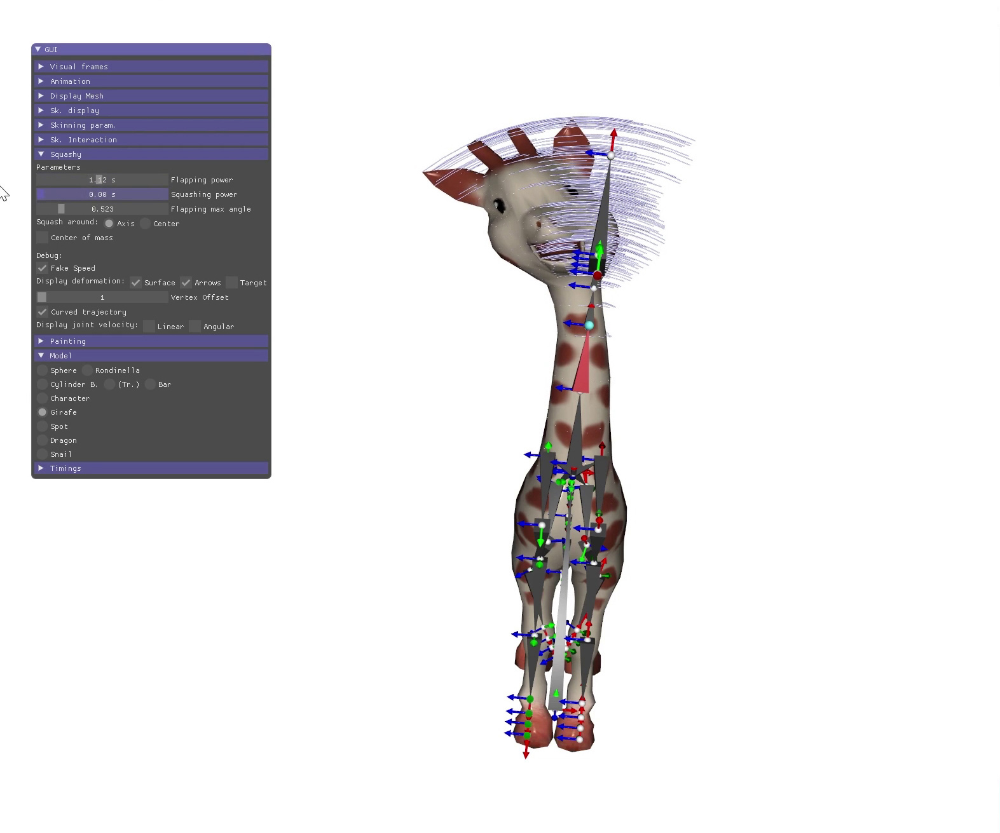
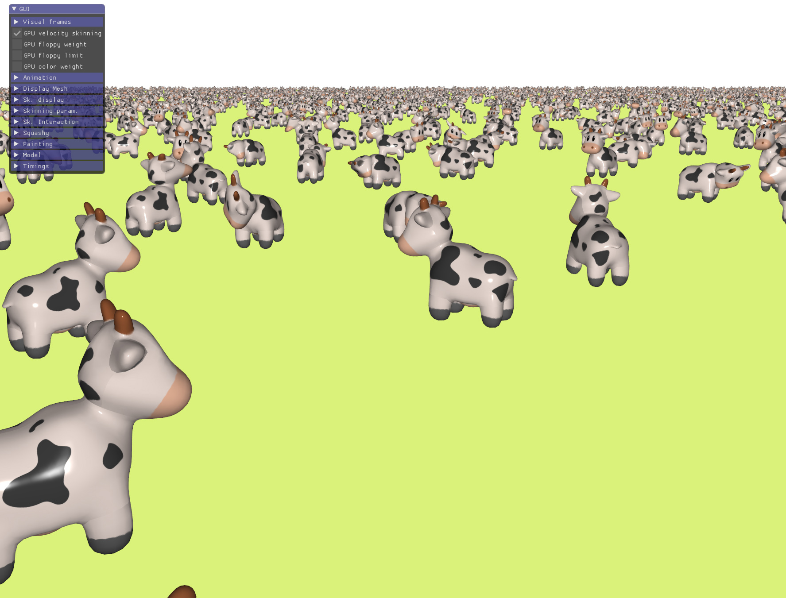

# Velocity Skinning code replicability

- [Introduction](#Introduction)
- [Code use](#CodeUse)
- [Compilation](#Compilation)
  - [Linux](#Linux)
  - [Windows](#Windows)
- [Citation](#Citation)
- [License](#License)


<a name="Introduction"></a>
## Introduction

This repository provides the codes used to reproduce the results shown in the following paper: _**Velocity Skinning for Real-time Stylized Skeletal Animation**. Damien Rohmer, Marco Tarini, Niranjan Kaylyanasyndaram, Faezeh Moshfeghifar, Marie-Paule Cani, Victor Zordan. Eurographics, Computer Graphics Forum vol.40, n.2, 2021._

A project webpage associated to this article is available at: [https://velocityskinning.com](https://velocityskinning.com).


<a name="CodeUse"></a>
## Code use


### Camera control and interaction

- left click + mouse drag: rotation
- right click + mouse drag: zoom
- CTRL + left click + mouse drag: pan
- CTRL + right click + mouse drag: translation forward/backward
- SHIFT + left click on a joint: joint selection (followed by mouse drag to articlate it)


### Generic code

The directory `01_fig_generic/` contains the standard C++ implementation used to generate most of the illustrative images didn't requiering GPU acceleration.

The following [video](assets/use_code_01_fig_generic.mp4) describes the use of this code to generate most of the figures (such as Fig.4, 5, 9, and 10), and results shown in the demonstration video.


<a href="assets/use_code_01_fig_generic.mp4"></a>


### GPU Cthulhu - Fig11

The directory `02_fig11_gpu/` contains the GPU implementation set to display the Cthulhu character in looping animation.


### GPU Cows - Fig Teaser

The directory `03_fig_teaser_cow_meadow/` contains the GPU implementation set to display the meadow of cows corresponding to the right-side of the teaser image.



### Web - Fig12/Dragon

The directory `04_dragon_web/` contains the web implementation that was used to take the view of the dragon shown in Fig.12.

* The code is fully implemented in JavaScript.
* The webpage may need a server (ex. python3 -m  http.server) to load the mesh files.
* A hosted version is available at [https://velocityskinning.com/web_demo/index.html](https://velocityskinning.com/web_demo/index.html).


<a name="Compilation"></a>
## Compilation

<a name="Linux"></a>
### Linux

#### External dependencies

Requires a C++ compiler, cmake, libglfw3

* Command lines to set-up an Ubuntu system from scratch

```shell
# Basic development tools (g++, make, etc)
sudo apt-get install build-essential

# CMake 
sudo apt-get install cmake 

# GLFW
sudo apt-get install libglfw3-dev
```

#### Compile and execute the code

__Ex. to compile the code in directory `01_fig_generic/` (and others) using the default Makefile (for standard system)__

* Open a command line in 01_fig_generic/ directory 

```shell
make
./scene
```


__Ex. to compile the code in directory `01_fig_generic/` (and others) using CMake (should work on more various systems)__

* Open a command line in 01_fig_generic/ directory

```shell
# Generate the directory build/
mkdir build 

# Go to the build/ directory
cd build

# Run CMake
cmake ..
# A file Makefile should be generated

# Compile
make
# Make sure the compilation succeed, a file pgm should be created

# Go back to the root directory
cd ..

# Run the executable from the root directory
build/sample_code 
```

<a name="Windows"></a>
### Windows

Method to compile with Visual Studio 2019 and CMake the code in directory `01_fig_generic/` (similar operations for 02_fig_11_gpu and 03_fig_teaser_cow_meadow).

#### Generate the Visual Studio project

* Start CMake (cmake-gui)
  *  Fill "Where is the source code" with the full path to the directory 01_fig_generic/
  * Fill "Where to build the binaries" with the full path to 01_fig_generic/build
* Click **Configure**
* Once the configuration is done, click on **Generate**

_If successfull, a build/ directory is created and contains the file **pgm.sln**_


#### Setup Visual Studio

* Start Visual Studio and open the project file `pgm.sln`

**In the solution explorer**

* Right click on Solution 'projectName' (Solution 'sample_code' in the sample code) and select **Properties**
* Change the value of `Single startup project` to `pgm` (this sets Visual Studio to compile the current project instead of a generic "All_BUILD" empty project).


**In the top toolbar**

* Change the build type from 'Debug' to '**RelWithDebInfo**' (this allows to have optimal runtime performance, while preserving debug information).


* In **Local Windows Debugger**, select 'projectName Debug Properties'.
* In the General properties (selected by default) change the value of **Output Directory** in removing the directory 'build\RelWithDebInfo\' from the path (the end of the pathname)
  * _(As a result, the executable `pgm.exe` will be generated in the root directory of the project instead of a build\RelWithDebInfo\ subdirectory)._


* In the **Debugging** property change the value of **Working Directory** from $(ProjectDir) to **$(TargetDir)**

* The project should now be ready to be compiled and run.


<a name="Citation"></a>
## Citation

```bibtex
@article{velocityskinning2021,
title={Velocity Skinning for Real-time Stylized Skeletal Animation},
author={Damien Rohmer, Marco Tarini, Niranjan Kaylyanasyndaram, Faezeh Moshfeghifar, Marie-Paule Cani, Victor Zordan},
journal={Computer Graphics Forum, Proc. Eurographics},
volume = {40},
number = {2},
year={2021},
}
```

<a name="License"></a>
## License

The code is released under MIT License. See LICENSE for details.